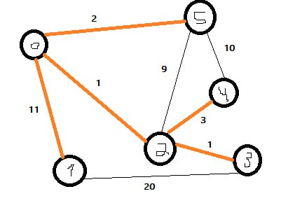

# 🌳 Minimum Spanning Tree (MST) Client-Server Application

<div align="center">
  
  <p><em>Example of a Minimum Spanning Tree</em></p>
</div>

## 📋 Project Overview

This project implements a client-server application for calculating and analyzing Minimum Spanning Trees (MST) in graphs. The system demonstrates several advanced operating systems concepts including:

- 🔄 **Client-Server Architecture**: Communication between client and server processes
- 🧵 **Concurrency Patterns**: 
  - Leader-Follower Thread Pool
  - Active Object Pattern with Pipeline Processing
- 🧮 **MST Algorithms**:
  - Kruskal's Algorithm
  - Prim's Algorithm
- 📊 **Graph Analysis**:
  - Total MST Weight
  - Longest Distance between Vertices
  - Average Distance between Vertices
  - Shortest Path between Selected Vertices

## ✨ Features

- 📥 **Graph Input**: Client can define a graph by specifying vertices and edges with weights
- 🔄 **Algorithm Selection**: Choose between Prim's or Kruskal's algorithm for MST calculation
- 🔄 **Real-time Algorithm Switching**: Change MST algorithm during runtime
- 🛣️ **Path Analysis**: Calculate shortest paths between any two vertices in the graph
- 🚀 **Concurrent Processing**: Server handles multiple client requests simultaneously using thread pools
- 🔄 **Pipeline Processing**: Three-stage pipeline for reading, processing, and sending data

## 🏗️ System Architecture

<div align="center">
  <pre>
  ┌─────────┐     TCP/IP     ┌─────────┐
  │ Client  │◄──Connection──►│ Server  │
  └─────────┘                └─────────┘
       │                          │
       ▼                          ▼
  ┌─────────┐               ┌─────────┐
  │ User    │               │ Thread  │
  │ Input   │               │ Pool    │
  └─────────┘               └─────────┘
                                 │
                                 ▼
                            ┌─────────┐
                            │ Pipeline │
                            │ Stages   │
                            └─────────┘
                                 │
                                 ▼
                            ┌─────────┐
                            │ MST     │
                            │ Factory │
                            └─────────┘
  </pre>
</div>

### Components

1. 🖥️ **Server**: 
   - Accepts client connections
   - Processes graph data using selected MST algorithm
   - Calculates metrics (total weight, distances)
   - Sends results back to clients

2. 💻 **Client**:
   - Connects to server
   - Sends graph data and algorithm choice
   - Receives and displays MST metrics
   - Allows for algorithm switching and path calculations

3. 🧩 **MST Implementation**:
   - Strategy Pattern for algorithm selection
   - Factory Pattern for creating MST algorithm instances
   - Common implementation for shared functionality

4. 🧵 **Concurrency Model**:
   - Leader-Follower Thread Pool for connection handling
   - Active Pipeline for staged processing of client requests

## 🚀 Building and Running

### Prerequisites

- ⚙️ C++ compiler with C++20 support
- 🐧 POSIX-compliant operating system (Linux/macOS/WSL)
- 🔨 Make build system

### Compilation

To build both the server and client applications:

```bash
make all
```

To build only the server:

```bash
make server
```

To build only the client:

```bash
make client
```

To clean the build files:

```bash
make clean
```

### 🏃‍♂️ Running the Application Step-by-Step

#### Step 1: Open Two Terminal Windows

You'll need two separate terminal windows or tabs to run both the server and client.

#### Step 2: Start the Server

In Terminal 1:
1. Navigate to the project directory:
   ```bash
   cd path/to/OperatingSystems_FinalProject
   ```
2. Make sure the server is compiled:
   ```bash
   make server
   ```
3. Start the server:
   ```bash
   ./server
   ```
4. You should see output indicating the server is running and waiting for connections.

#### Step 3: Start the Client

In Terminal 2:
1. Navigate to the project directory:
   ```bash
   cd path/to/OperatingSystems_FinalProject
   ```
2. Make sure the client is compiled:
   ```bash
   make client
   ```
3. Start the client:
   ```bash
   ./client
   ```
4. The client will automatically connect to the server running on localhost.

#### Step 4: Using the Client

In Terminal 2 (where the client is running):

1. **Enter Graph Information**:
   - When prompted, enter the number of vertices (e.g., `4`)
   - Enter the number of edges (e.g., `5`)

2. **Define Edges**:
   - For each edge, you'll be prompted to enter:
     - Source vertex (e.g., `0`)
     - Destination vertex (e.g., `1`)
     - Weight (e.g., `10`)
   - Example format: `0 1 10` (This creates an edge from vertex 0 to vertex 1 with weight 10)

3. **Choose MST Algorithm**:
   - Type either `Prim` or `Kruskal` when prompted

4. **View Results**:
   - The server will calculate and return:
     - Total weight of the MST
     - Longest distance between vertices
     - Average distance between vertices

5. **Additional Operations**:
   - Choose from the menu:
     - Option `1`: Change MST Algorithm
     - Option `2`: Calculate shortest distance between two vertices
     - Option `3`: Exit

6. **For Option 1 (Change Algorithm)**:
   - Enter `1` for Prim or `2` for Kruskal
   - View the updated MST metrics

7. **For Option 2 (Calculate Shortest Distance)**:
   - Enter the two vertex numbers (e.g., `0 3`)
   - View the shortest distance between them

8. **To Exit**:
   - Enter `3` to close the client connection

#### Step 5: Monitoring the Server

In Terminal 1 (where the server is running):
- You can observe the server processing client requests
- Each client connection and operation will be logged
- To stop the server, press `Ctrl+C`

## 🔍 Implementation Details

### MST Algorithms

- 🧩 **Kruskal's Algorithm**: 
  - Uses Disjoint Set data structure to find MST
  - Sorts edges by weight and adds them if they don't create cycles

- 🧩 **Prim's Algorithm**: 
  - Uses priority queue to find MST
  - Grows the MST one vertex at a time

### Concurrency Patterns

- 🧵 **Leader-Follower Thread Pool**: 
  - One thread (leader) accepts connections
  - Remaining threads (followers) process client requests
  - Dynamic promotion of followers to leader role

- 🔄 **Active Pipeline**:
  - Three-stage pipeline: Read → Process → Send
  - Each stage runs in its own thread
  - Tasks flow through the pipeline asynchronously

## 🛡️ Memory Management

The project uses modern C++ memory management techniques:
- 📦 Smart pointers for automatic resource management
- 🔒 RAII principles for resource acquisition and release
- 🛡️ Exception-safe design

## ⚠️ Error Handling

- 🔄 Robust error handling for socket operations
- 🔌 Graceful handling of client disconnections
- 🧹 Proper cleanup of resources on shutdown

## ⚡ Performance Considerations

- 🧵 Thread pool size adapts to hardware concurrency
- 📊 Efficient graph representation for MST algorithms
- 🚀 Optimized path finding algorithms

## 📝 Example Usage Scenario

<div align="center">
  <pre>
  ┌───────────────┐     ┌───────────────┐
  │   Terminal 1  │     │   Terminal 2  │
  │   (Server)    │     │   (Client)    │
  └───────────────┘     └───────────────┘
         │                     │
         ▼                     ▼
    ./server                ./client
         │                     │
         │                     ▼
         │               Enter vertices: 4
         │                     │
         │                     ▼
         │               Enter edges: 5
         │                     │
         │                     ▼
         │               Edge 1: 0 1 10
         │               Edge 2: 0 2 6
         │               Edge 3: 0 3 5
         │               Edge 4: 1 3 15
         │               Edge 5: 2 3 4
         │                     │
         │◄───────────────────┘
         │                     │
         ▼                     ▼
  Process request         Choose: Kruskal
         │                     │
         ▼                     ▼
  Calculate MST          Display results:
         │               - Total weight: 15
         └───────────────► - Longest path: 19
                         - Avg distance: 8.5
  </pre>
</div>


